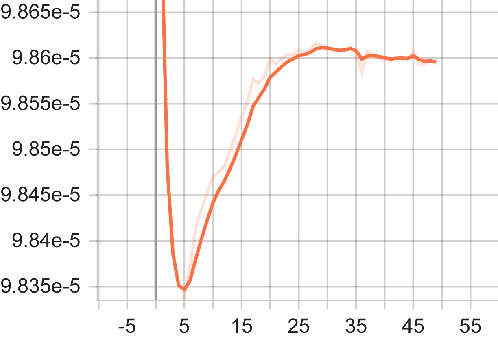
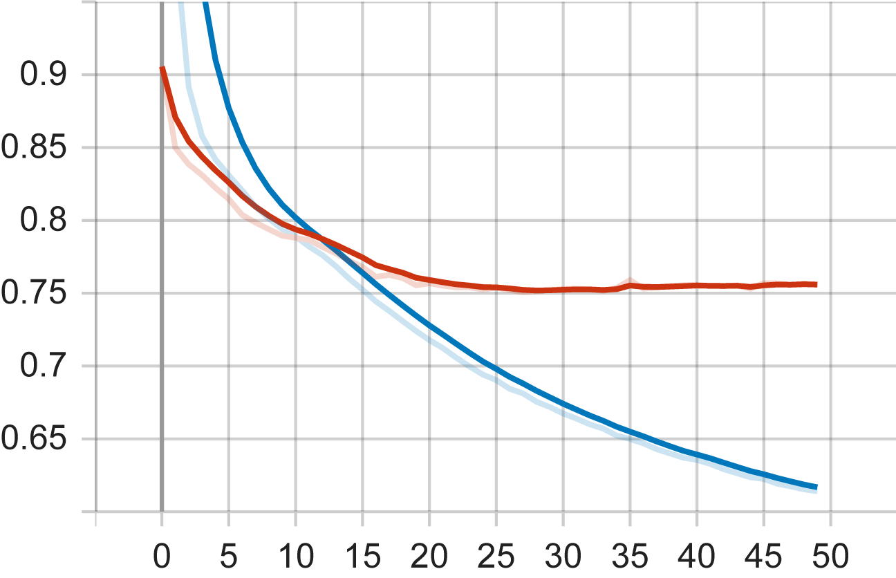

# Deep Learning Based Movie Recommendation System

Get movie recommendations for specific user from recommendation model that trained on MovieLens-1M dataset.

## Requirements

First clone this repo and change directory into this folder. It is highly recommended to use the conda virtual environment to set up an environment with required libraries and dependencies. 

- For systems without GPU:
```bash
conda env create -f requirements_cpu.yaml
```
- For systems with GPU:
```bash
conda env create -f requirements_gpu.yaml
```
- [COLAB](https://colab.research.google.com/drive/1NubvnjrdFdfwYP09N6zl-LA-FuKikm4m?usp=sharing)

## How to Use?
To train with default parameters run;
```bash
python main.py
```

Additionaly you can play around with below arguments. 
```python
    arg.add_argument('--data_path', type=str, default=Path.home(), 
                    help='Path to the data directory')
    arg.add_argument('--data_url', type=str, default='http://files.grouplens.org/datasets/movielens/ml-1m.zip')
    arg.add_argument('--user_id', type=int, default=1, 
                    help='User ID to recommend movies for')
    arg.add_argument('--model_layers', type=list, default=[128 ,64, 32], 
                    help='Number of layers in each hidden layer with any desired depth')
    arg.add_argument('--epoch_number', type=int, default=50, 
                    help='Number of epochs to train')
    arg.add_argument('--batch_size', type=int, default=4096)
    arg.add_argument('--learning_rate', type=float, default=0.001)
    arg.add_argument('--weight_decay', type=float, default=0.001)
    arg.add_argument('--dropout_rate', type=float, default=0.5)
    arg.add_argument('--opt', type=str, default='adam', choices=['adam', 'sgd', 'rmsprop'])
    arg.add_argument('--scheduler', type=str, default='cosine', choices=['cosine', 'reduce'])
    arg.add_argument('--wandb', type=bool, default=False, 
                    help='Whether to use wandb tool for hyperparameter tuning')
    arg.add_argument('--hp_run_number', type=int, default=200,
                    help='Number of hyperparameter tuning runs')
```
If you set "wandb" argument as True,  [Wandb](https://wandb.ai/site) tool will start to try hyperparameters listed in hp_tuner.py below. Otherwise one can directly train the model via arguments above.
```bash
            'optimizer': {'values': ['sgd', 'adam', 'rmsprop']},
            'learning_rate': {'values': [0.001, 0.0005, 0.0001, 0.00005]},
            'epochs': {'values': [50]},
            'model_layers': {'values': [[256, 128, 64, 32], [128, 64, 32], [64, 32]]},
            'scheduler': {'values': ['CosineAnnealingLR', 'ReduceLROnPlateau']},
            "batch_size": {'values': [512, 1024, 2048, 4096]},
            "weight_decay": {'values': [0., 1e-5, 1e-3]}
```

## Results
In this [LINK](https://wandb.ai/furkandurmus/Huawei?workspace=user-furkandurmus) hyperparameter tuning with random search results can be observed.  The best results were obtained with the following parameters:

| Parameter     |      Value      |
|---------------|:---------------:|
| Learning rate |      0.0001     |
| Optimizer     |      rmsprop    |
| Scheduler     | CosineAnnealing |
| Batch Size    |       512       |
| Hidden Layers | [256,128,64,32] |
| Weight Decay  |      0.00001    |
| Dropout       |      0.5        |
| Test Loss     |      0.75       |
| RMSE          |      0.86       |

Learning Rate Curvature During Training



Train and Test Losses




Prediction outputs of the model with best weights:
------------------------------------------------------------
Recommended Top 5 Films for user 1


Toy Story (1995) : Animation|Children's|Comedy


Persuasion (1995) : Romance


Hunchback of Notre Dame, The (1996) : Animation|Children's|Musical


E.T. the Extra-Terrestrial (1982) : Children's|Drama|Fantasy|Sci-Fi


Pleasantville (1998) : Comedy


------------------------------------------------------------
